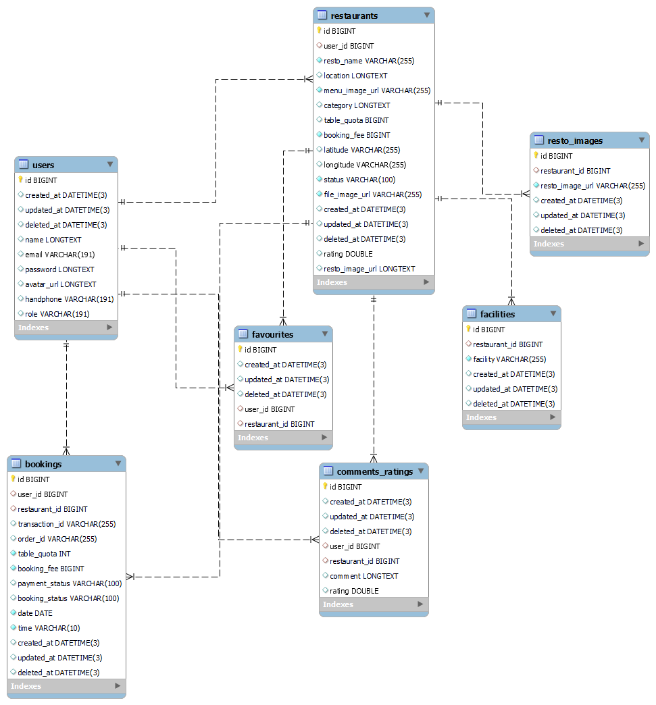

# Wisata Foodie Group 3

<!-- ABOUT THE PROJECT -->

## 💻 About The Project

WisataFoodie is made to make it easier for tourists to find restaurants

Features in Wisata Foodie :

<div>
      <details>
<summary>🙎 Users</summary>
  
  <!---
  | Command | Description |
| --- | --- |
  --->
  
At users, there are features for login either user or admin, we also make CRUD for the user here
 
<div>
  
| Feature User | Endpoint | Param | JWT Token | Function |
| --- | --- | --- | --- | --- |
| POST | /users  | - | NO | new account registration |
| POST | /login | - | NO | login for user/admin |
| PUT | /users | - | YES | update/edit information user |
| DELETE | /users | - | YES | delete user account |
| GET | /myprofile | - | YES | read his own information/profile |


</details>

       
<div>
      <details>
<summary>🍴 Restaurants</summary>
  
  <!---
  | Command | Description |
| --- | --- |
  --->
  
At restaurants, there are features for CRUD the restaurant and booking the restaurant
 
<div>
  
| Feature Restaurant | Endpoint | Param | JWT Token | Function |
| --- | --- | --- | --- | --- |
| POST | /restaurants  | - | YES | create new restaurant |
| PUT | /restaurants | - | YES | edit the restaurant information |
| DELETE | /restaurants | - | YES | delete restaurant |
| GET | /restaurants | - | NO | get all restaurants information |
| GET | /restaurants | restaurant id | NO | get the restaurant information/detail |
| GET | /myresto | - | YES | get the restaurant information that he/her owned |
| POST | /restaurants/booking  | restaurant id | YES | to book the restaurant |
| POST | /restaurants/upload  | - | YES | to upload retaurant images |
| GET | /search-restaurant  | search | NO | search the restaurant |


</details>
       
<div>
      <details>
<summary>⭐ Favourites</summary>
  
  <!---
  | Command | Description |
| --- | --- |
  --->
  
At favourites, there are features for Add, Delete and Get the list of all restaurants that he/her favourited
 
<div>
  
| Feature Favourite | Endpoint | Param | JWT Token | Function |
| --- | --- | --- | --- | --- |
| POST | /favourites  | restaurant id | YES | add restaurant into favourite list |
| DELETE | /favourites | restaurant id | YES | adelete restaurant from favourite list |
| GET | /favourites | - | YES | get all restaurants that are on his/her favourite list |

</details>      

     
       
<div>
      <details>
<summary>👨‍💻 Admins</summary>
  
  <!---
  | Command | Description |
| --- | --- |
  --->
  
At admins, there are features for getting the list of all users and restaurants, and also the verification for the restaurant to appear on homepage

⚠️ you have to log in with an account that has an admin role to access the following features ⚠️
 
<div>
  
| Feature Admin | Endpoint | Param | JWT Token | Function |
| --- | --- | --- | --- | --- |
| GET | /admins/users  | - | YES | get the list of all users |
| GET | /admins/restaurants | - | YES | get the list of all restaurants |
| GET | /admins/restaurants | restaurant id | YES | get detail of the restaurant |
| POST | /admins/verif | restaurant id | YES | for verification the restaurant |

</details>  
       
</details>
       
<div>
      <details>
<summary>💭 Comments and Ratings </summary>
  
  <!---
  | Command | Description |
| --- | --- |
  --->
  
At Comments and Ratings, there are features for post the comment and rating, get rating and all comments in restaurant 
 
<div>
  
| Feature Comment & Rating | Endpoint | Param | JWT Token | Function |
| --- | --- | --- | --- | --- |
| POST | /comments  | restaurant id | YES | post your comment and rating |
| GET | /comments | restaurant id | NO | get all comments in restaurant |
| GET | /comments/rating | restaurant id | NO | get the restaurant rating |

</details>   
       
### 🛠 &nbsp;Build App & Database


         
## 🗃️ ERD


      
       

## Run Locally

Clone the project

```bash
  git clone https://github.com/GROUP-3-FE-EVENT-PLANNING-APP/BE-capstone-foodie.git
```

Go to the project directory

```bash
  cd BE-capstone-foodie
```

## Open Api

if you want to consume our api,
here's the way !

```bash
https://app.swaggerhub.com/apis-docs/dpurbosakti/wisatafoodie/1.0.0#/
```

## Docker Image

you may want to run our docker image on your container too,

```bash 
https://hub.docker.com/repository/docker/dwiatmoko/capstone-group3
```
## Authors

- Dwiatmoko Purbosakti
       
  Reach me:
  [](https://www.linkedin.com/in/dwi-atmoko-purbo-sakti-573b861ba/)
  [](https://github.com/dpurbosakti)
  [](https://twitter.com/dpurbosakti)
       
- Syawal Adiyaksa
       
  Reach me:
  [](https://www.linkedin.com/in/syawal-adiyaksa/)
  [](https://github.com/syawaladiyaksa15)
  
       
 <p align="right">(<a href="#top">back to top</a>)</p>
<h3>
<p align="center">:copyright: 2022 | Built with jerih payah dan keringat kami berdua </p>
</h3>
<!-- end -->

